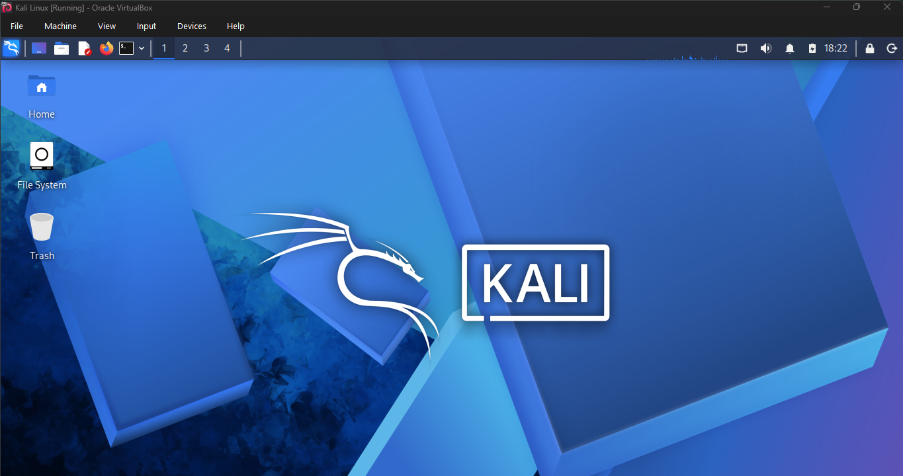
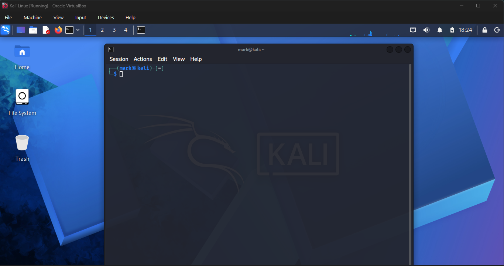
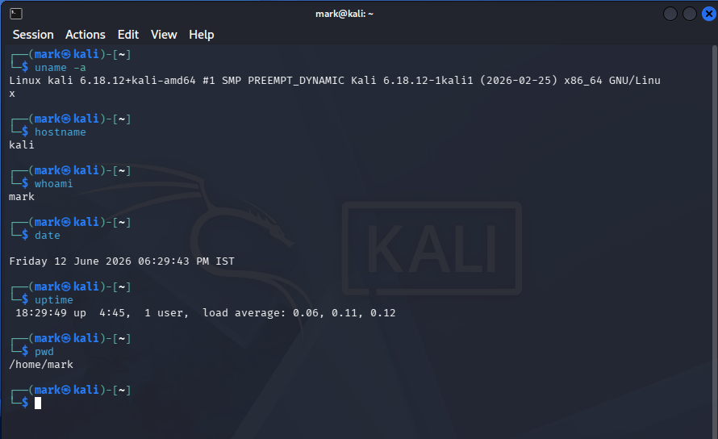
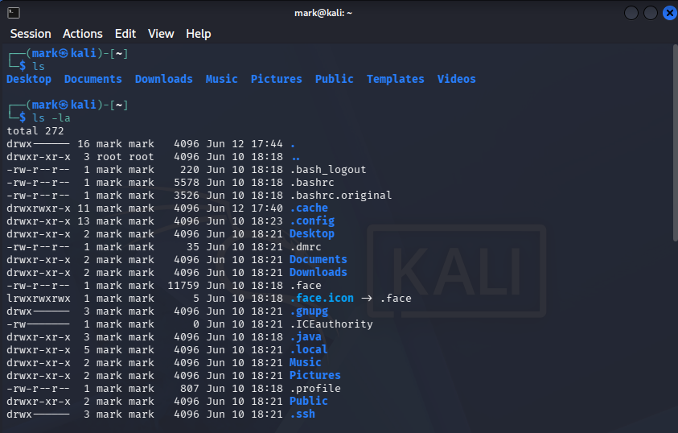
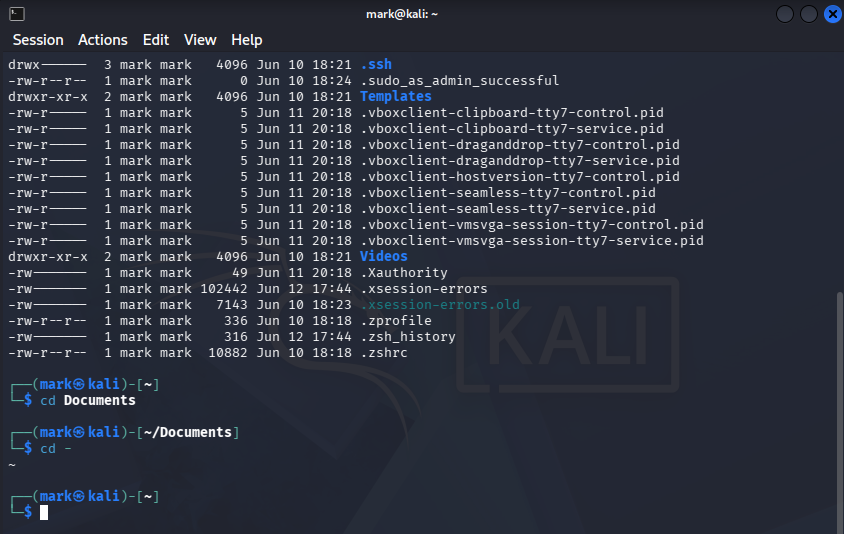
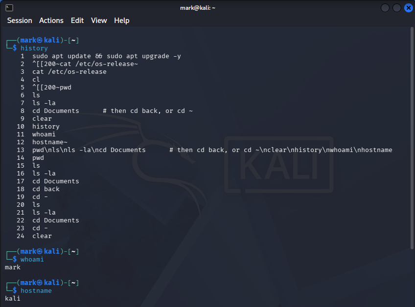
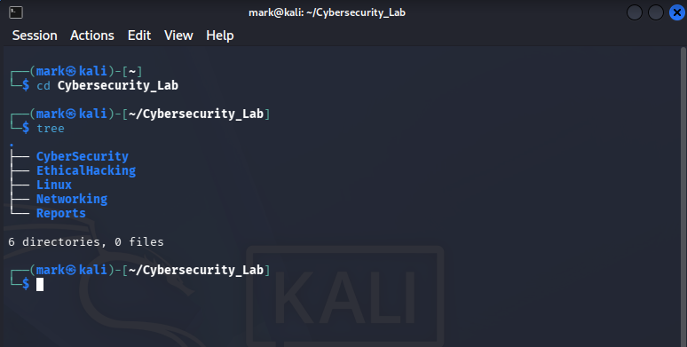
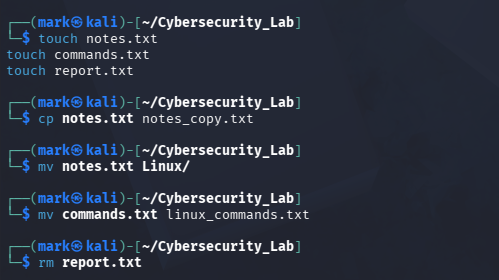

# Linux Task 01: Linux Environment Setup & Essential Commands

---

| Field        | Details                        |
|--------------|--------------------------------|
| **Name**     | Mark                            |
| **Date**     | 12 June 2026                   |
| **Task**     | Linux Task 01                  |
| **Platform** | White Band Associates Internship |

---

## 📑 Table of Contents

- [Objective](#objective)
- [Part A: Linux Installation & Verification](#part-a-linux-installation--verification)
- [Part B: Basic Navigation Commands](#part-b-basic-navigation-commands)
- [Part C: Directory Management](#part-c-directory-management)
- [Part D: File Management](#part-d-file-management)
- [Part E: System Information Collection](#part-e-system-information-collection)
- [Part F: Linux Research Activity](#part-f-linux-research-activity)
  - [1. What is Linux?](#1-what-is-linux)
  - [2. Why is Linux Important in Cyber Security?](#2-why-is-linux-important-in-cyber-security)
  - [3. Difference Between Linux and Windows](#3-difference-between-linux-and-windows)
  - [4. What is a Linux Distribution?](#4-what-is-a-linux-distribution)
  - [5. Why Do Ethical Hackers Prefer Linux?](#5-why-do-ethical-hackers-prefer-linux)

---

## Objective

The purpose of this task is to become familiar with the Linux operating system, terminal usage, navigation, and basic file management commands.

Linux is one of the most important skills for Cyber Security professionals, System Administrators, and Ethical Hackers.

---

## Part A: Linux Installation & Verification

**Installed Distribution:** Kali GNU/Linux Rolling (on VirtualBox VM)

| Item              | Details                         |
|-------------------|----------------------------------|
| OS                | Kali GNU/Linux Rolling           |
| Kernel            | Linux 6.18.12+kali-amd64         |
| Architecture      | x86_64                            |
| Hardware Model    | VirtualBox (innotek GmbH)        |
| Hostname          | kali                              |
| Terminal          | Kitty / GNOME-style Kali Terminal |

> Note: `neofetch` was not installed (`command not found`), so `uname -a` was used instead to display system information.

**Desktop Environment**



**Terminal Window**



**System Information (`uname -a`)**



---

## Part B: Basic Navigation Commands

### Commands & Purpose

| Command    | Purpose                                                         |
|------------|-------------------------------------------------------------------|
| `pwd`      | Prints the current working directory (full path)                 |
| `ls`       | Lists files and folders in the current directory                 |
| `ls -la`   | Lists all files including hidden ones with permissions & sizes   |
| `cd`       | Changes the current directory                                     |
| `clear`    | Clears all output from the terminal screen                       |
| `history`  | Displays a list of previously executed commands                  |
| `whoami`   | Shows the username of the currently logged-in user (`mark`)      |
| `hostname` | Displays the name of the computer/machine (`kali`)               |

**`ls` and `ls -la`**



**`cd Documents` and `cd -`**



**`history`, `whoami`, `hostname`**



---

## Part C: Directory Management

### Structure Created:

```
Cybersecurity_Lab/
│
├── CyberSecurity/
├── EthicalHacking/
├── Linux/
├── Networking/
└── Reports/
```

### Commands Used:

```bash
mkdir -p Cybersecurity_Lab/{Networking,Linux,CyberSecurity,EthicalHacking,Reports}
cd Cybersecurity_Lab
tree
```

**Output:** `6 directories, 0 files`

| Command | Purpose                                    |
|---------|----------------------------------------------|
| `mkdir` | Creates a new directory                      |
| `cd`    | Navigates into the created directory         |
| `tree`  | Displays directory structure in tree view    |

**Directory Creation + Tree Output**



---

## Part D: File Management

### Files Created Inside `Cybersecurity_Lab`:

- `notes.txt`
- `commands.txt`
- `report.txt`

### Operations Performed:

| Operation      | Command Used                  | Result                                |
|----------------|--------------------------------|------------------------------------------|
| Create file    | `touch notes.txt commands.txt report.txt` | Created 3 empty files          |
| Copy file      | `cp notes.txt notes_copy.txt` | Created a copy of `notes.txt`            |
| Move file      | `mv notes.txt Linux/`         | Moved `notes.txt` into the `Linux` folder |
| Rename file    | `mv commands.txt linux_commands.txt` | Renamed `commands.txt` to `linux_commands.txt` |
| Delete file    | `rm report.txt`               | Deleted `report.txt`                     |

### Command Descriptions:

| Command | Purpose                                                    |
|---------|----------------------------------------------------------------|
| `touch` | Creates a new empty file                                       |
| `cp`    | Copies a file from one location to another                     |
| `mv`    | Moves a file to a new location or renames it                   |
| `rm`    | Permanently deletes a file                                     |

**File Operations (touch, cp, mv, rm)**



---

## Part E: System Information Collection

### Commands Run:

```bash
uname -a
hostname
whoami
date
uptime
pwd
```

### Recorded Output:

| Field               | Value                                            |
|----------------------|------------------------------------------------------|
| Kernel Version      | Linux kali 6.18.12+kali-amd64 #1 SMP PREEMPT_DYNAMIC Kali 6.18.12-1kali1 (2026-02-25) x86_64 GNU/Linux |
| Hostname            | kali                                                  |
| Username            | mark                                                  |
| Current Date & Time | Friday, 12 June 2026, 06:29:43 PM IST               |
| System Uptime       | up 4 hours 45 minutes, 1 user, load average: 0.06, 0.11, 0.12 |
| Current Directory   | /home/mark                                           |

**System Information Output**


---

## Part F: Linux Research Activity

### 1. What is Linux?

Linux is a free and open-source operating system kernel originally created by Linus Torvalds in 1991. It forms the base of many operating systems (called distributions) and powers servers, desktops, smartphones, embedded systems, and supercomputers around the world. Unlike Windows, Linux is highly customizable and gives users full control over the system.

---

### 2. Why is Linux Important in Cyber Security?

Linux is widely used in cyber security because:

- Most security tools like **Nmap**, **Wireshark**, **Metasploit**, and **Burp Suite** are built for Linux.
- It offers deep access to networking, processes, and file systems.
- It supports shell scripting and automation for repetitive security tasks.
- It is open-source, allowing professionals to study and modify the OS itself.
- Security-focused distributions like **Kali Linux** and **Parrot OS** come with hundreds of pre-installed tools.

---

### 3. Difference Between Linux and Windows

| Feature            | Linux                          | Windows                        |
|--------------------|---------------------------------|-----------------------------------|
| Cost               | Free and open-source            | Paid / requires a license         |
| Customization      | Highly customizable             | Limited customization             |
| Security           | More secure, fewer viruses      | More targeted by malware          |
| Terminal           | Powerful command-line (Bash)    | Limited (CMD / PowerShell)        |
| Server Usage       | Powers ~96% of web servers      | Less common in servers            |
| User Base          | Developers, security experts    | General users, enterprises        |

---

### 4. What is a Linux Distribution?

A Linux distribution (or **distro**) is a complete operating system built on the Linux kernel, packaged with a desktop environment, package manager, and pre-installed software.

**Popular Distributions:**

| Distribution | Purpose                              |
|---------------|------------------------------------------|
| Ubuntu       | General-purpose desktop/server use       |
| Kali Linux   | Penetration testing & ethical hacking    |
| Parrot OS    | Privacy and security focused              |
| Fedora       | Developer-focused, cutting-edge           |
| Debian       | Stable server and desktop use             |

---

### 5. Why Do Ethical Hackers Prefer Linux?

Ethical hackers prefer Linux because:

- Distributions like **Kali Linux** come pre-loaded with 600+ hacking and security tools.
- Linux allows raw socket access, packet manipulation, and network monitoring at a low level.
- It supports anonymization tools like **Tor** and **Proxychains** natively.
- The terminal allows fast, precise, and scriptable operations that GUI tools cannot match.
- Most real-world attack and defense environments (servers, cloud, IoT) run on Linux, making it essential to understand.
